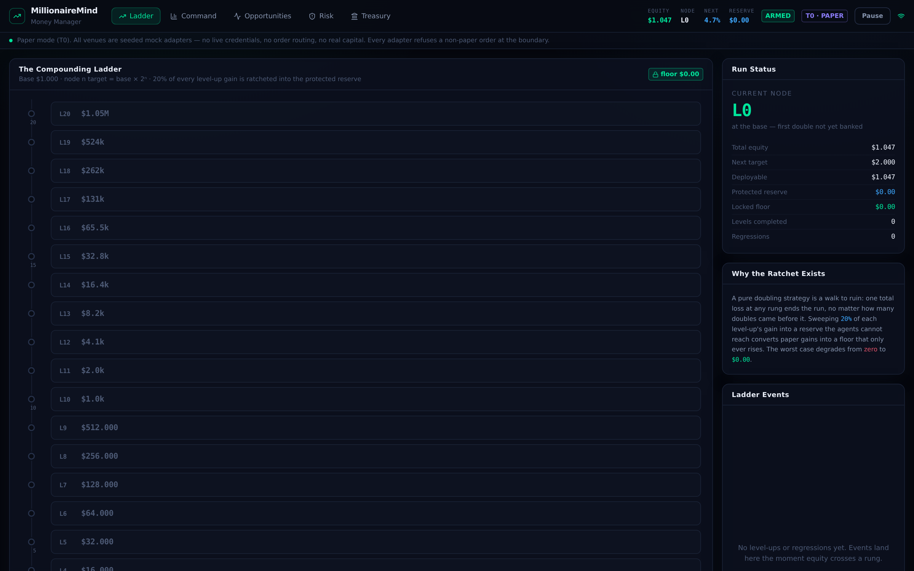
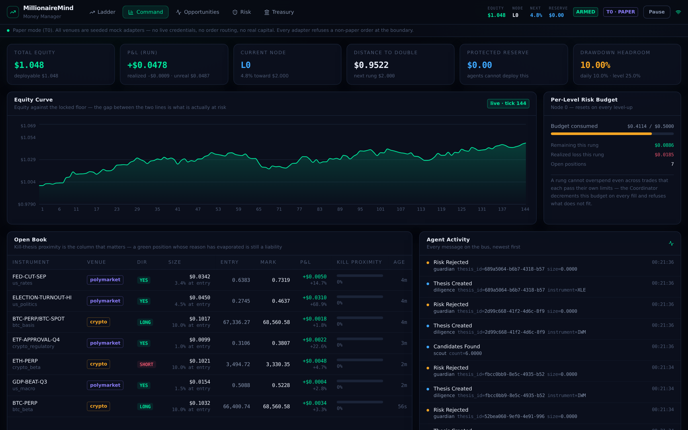
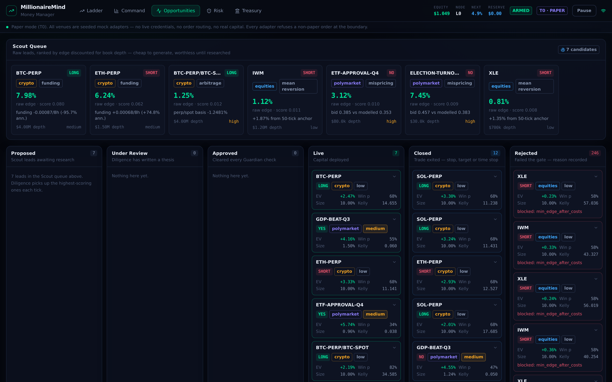
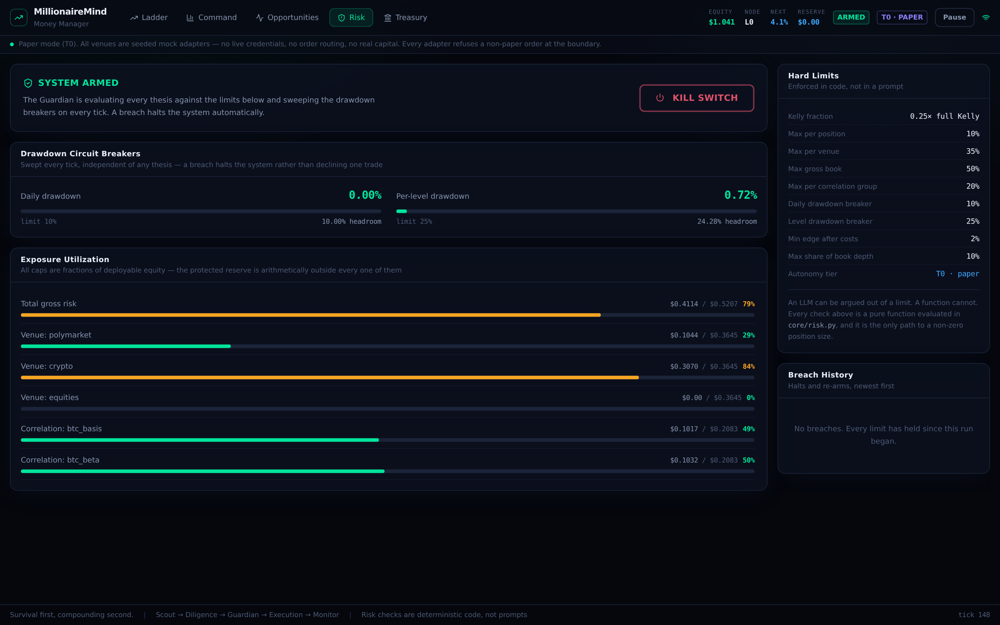
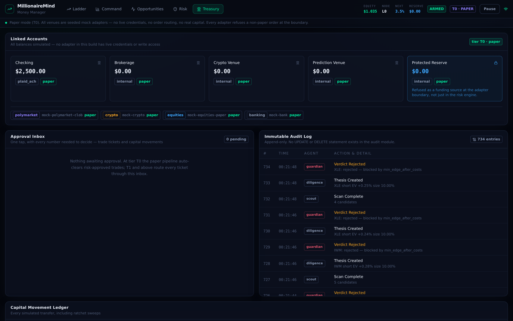

# MillionaireMind — Money Manager

[Open MillionaireMind](https://neofrees.github.io/millionairemind/) — a GitHub Pages preview of the frontend.

An autonomous, research-gated capital-compounding platform. It takes a starting
bankroll and climbs a 20-node equity-doubling ladder, deploying capital **only**
into opportunities that clear a written thesis, a quantified edge, and a hard
risk gate.

> **Prime directive: survival first, compounding second.** A strategy that
> doubles nine times and then goes to zero is a failure.

**This build ships paper-only (tier T0).** Every venue is a seeded mock adapter.
There are no live credentials, no order routing, and no real capital — each
adapter raises `LiveTradingDisabled` on any non-paper order, and the config
refuses to boot in a tier above T0.

---

## Screenshots

Dark-first, terminal-dense, mono numerals.

**The Ladder** — how far along the run am I, and is my floor rising?



**Command Dashboard** — KPIs, equity against the locked floor, the open book
with kill-thesis proximity per position, and the live agent feed.



**Opportunity Board** — Scout queue feeding the Diligence kanban. Every card
expands into the full thesis, checks and sources.



**Risk Console** — every hard limit, its live utilization, and the kill switch.



**Treasury & Approvals** — linked accounts, the approval inbox, and the
append-only audit log.



---

## Quick start

Two processes. Backend on `:8000`, frontend on `:5173`.

```bash
# ── backend ────────────────────────────────────────────────
cd backend
python3 -m venv .venv
.venv/bin/pip install -r requirements.txt
cp ../.env.example .env          # optional — defaults work out of the box
.venv/bin/python -m uvicorn app.main:app --reload --port 8000

# ── frontend (second terminal) ─────────────────────────────
cd frontend
npm install
npm run dev                      # http://localhost:5173
```

The simulation starts on boot and ticks every 2 seconds. Open the Ladder screen
and watch the pipeline run.

```bash
# tests — the risk core is the part that matters
cd backend && .venv/bin/python -m pytest -q     # 72 tests
cd frontend && npx tsc -b && npx vite build
```

### In VS Code

Open the repo root. `.vscode/launch.json` has a **Backend: uvicorn** debug
target; `.vscode/settings.json` points pytest at `backend/tests` and picks up
the venv interpreter. Recommended extensions are in `.vscode/extensions.json`.

---

## 1. The compounding ladder

Node *n* target equity = `base × 2ⁿ`. From a $1 base: L1=$2, L2=$4 … L20 ≈ $1,048,576.
The base unit is configurable (`MM_BASE_UNIT`) — start at $1 or $10,000.

| Event | Behaviour |
| --- | --- |
| **Level-up** | Fires when total equity ≥ the next node target. Locks a floor, resets the per-level risk budget, sweeps the ratchet. |
| **Regression** | If equity falls back below the current node's target, the ladder visibly steps *down*. Shown honestly — regression is a signal, not an error to hide. |

### The ratchet — why this exists

A pure doubling strategy is a walk to ruin. One total loss at any rung ends the
run no matter how many doubles preceded it. On every level-up a configurable
share of that level's gain (default 20%) is swept into a **protected reserve**:

- it is subtracted from `deployable` equity, so *every* position-size
  calculation is arithmetically incapable of touching it;
- the mock bank adapter separately refuses `protected_reserve` as a funding
  source, so a bug in the risk engine still cannot spend the floor;
- the floor is monotonic — `test_floor_never_falls_after_regression` and
  `test_equity_curve_tracks_and_never_loses_the_floor` enforce it.

Worst case degrades from *zero* to *the last locked floor*.

---

## 2. The agent mesh

Agents never call each other. They publish onto a message bus; the Coordinator
sequences the pipeline and owns the single source of truth.

```
Scout → Diligence → Guardian → (human gate if tier requires) → Execution → Monitor
```

| Agent | Mandate |
| --- | --- |
| **Scout** (`agents/scout.py`) | Scans venues for prediction-market mispricing, spot/perp basis dislocation, funding carry, and statistical mean-reversion. Emits ranked candidates — edge discounted by book depth. |
| **Diligence** (`agents/diligence.py`) | Turns a candidate into a complete `InvestmentThesis`: entry/exit levels, EV, probability *with a stated basis*, frictions, correlation bucket, and a **kill thesis**. Rejects anything with no edge after costs. |
| **Guardian** (`agents/guardian.py`) | Always-on, absolute veto. A thin logging wrapper around `core/risk.py`. Owns the kill switch. |
| **Execution** (`agents/execution.py`) | Routes a *risk-cleared* ticket. Its signature requires a `RiskVerdict` and it refuses anything not `approved`. Cancels fills whose realised slippage exceeded 2.5× the modelled figure. |
| **Treasury** (`agents/treasury.py`) | Capital movement. Every external rail is human-gated below T3. Performs the ratchet sweep. |
| **Monitor** (`agents/monitor.py`) | Marks positions, computes **kill-thesis proximity**, closes on stop/target/time-stop, escalates degraded theses, flags position-cap drift. |
| **Coordinator** (`agents/coordinator.py`) | Sequences the pipeline, enforces the per-level risk budget, holds all state. |

The agent bodies here are deterministic heuristics standing in for LLM agents.
The seam is deliberate: each takes structured input and returns structured
output, so replacing a body with an LLM call over MCP tools changes nothing
about the pipeline, the audit trail, or the risk gate.

---

## 3. Risk management — the spine

**Deterministic. In code. Not in a prompt.** An LLM can be argued out of a
limit; a function cannot. `core/risk.py::evaluate_thesis` is the only path to a
non-zero position size, and it evaluates thirteen checks, logging all of them —
passes included:

| Check | Enforces |
| --- | --- |
| `kill_switch` | Nothing clears while halted. |
| `autonomy_tier` | Paper-first mandate. |
| `position_cap` | Fractional Kelly (¼ default), hard-capped at 10% of deployable. |
| `positive_kelly` | No bet without a positive net-of-fees Kelly edge. |
| `min_edge_after_costs` | EV must clear 2% *after* fees and modelled slippage. |
| `liquidity` | Size ≤ 10% of top-of-book depth. |
| `venue_exposure` | ≤ 35% of deployable per venue. |
| `total_risk` | ≤ 50% gross book. |
| `correlation` | ≤ 20% per correlation bucket — stops the book becoming one bet in three costumes. |
| `daily_drawdown` | 10% breaker. Breach *halts the system*, not just the trade. |
| `level_drawdown` | 25% breaker, same. |
| `reserve_protected` | Asserts the reserve arithmetic rather than trusting it. |
| `thesis_complete` | No kill thesis or no sources ⇒ cannot reach capital. |

Plus a **per-level risk budget** in the Coordinator, so a rung cannot overspend
across many individually-compliant trades.

The **kill switch** trips automatically on a breach and only a human re-arms it.
Re-arming re-anchors the drawdown readings — without that, the still-true
breach re-trips on the next tick and the halt is permanently unclearable.

### Position sizing: two models, deliberately not one

This is the subtlest correctness issue in the codebase, and getting it wrong is
the classic way to inflate a backtest:

- **Prediction-market contracts are all-or-nothing.** Being wrong zeroes the
  stake. `kelly_binary` / `expected_value_pct` apply, with
  `payoff_ratio = (1 − price) / price`.
- **A stopped directional trade is not.** Being wrong costs the distance to the
  stop, not the notional. `kelly_directional` / `expected_value_directional`
  apply, both denominated in **notional** so that EV, size, P&L and the
  min-edge gate all compose.

Feeding a reward-to-risk ratio into the binary formula reports EV *per unit of
risk* while everything else is *per unit of notional* — the two differ by a
factor of `1 / stop_distance`. In this simulation that inflated funding-carry
EV from ~1.5% to ~81% and waved every directional thesis straight through the
2% gate. `test_binary_and_directional_models_disagree_by_the_stop_distance`
pins the relationship; `test_directional_ev_is_per_notional_not_per_risk`
guards the regression.

Note also that `kelly_directional` routinely returns values **above 1.0** — a
3% edge behind a 0.5% stop is "6× levered" by Kelly's reckoning. The absolute
position cap, not Kelly, is the binding constraint almost always. That is the
design working as intended.

---

## 4. Autonomy tiers

| Tier | Behaviour | Status in this build |
| --- | --- | --- |
| **T0 — Paper** | Full pipeline, zero real capital. | ✅ implemented, default |
| **T1 — Advisory** | Real research; every trade and payment needs a one-tap human approval. | interface + approval inbox present; needs live adapters |
| **T2 — Bounded** | Auto-execute within limits; capital movement still human-gated. | interface present |
| **T3 — High** | Autonomous within hard caps; above-threshold actions still gated. | interface present |

`Settings` **refuses to boot** above T0 rather than silently pretending to be
live. Promoting a tier requires writing real adapters, at which point the
refusal in `config.py` is the deliberate speed bump you have to remove on purpose.

---

## 5. Integration layer

Every venue sits behind a thin adapter (`adapters/base.py`), so a real venue
drops in without touching agent logic:

| Capability | Shipped | Real counterpart |
| --- | --- | --- |
| Prediction markets | `MockPolymarketAdapter` | Polymarket / CLOB |
| Crypto spot + perps | `MockCryptoAdapter` (incl. funding rates) | exchange testnet |
| Equities / ETFs | `MockEquitiesAdapter` | Alpaca-style paper API |
| Banking / payments | `MockBankAdapter` | Plaid, Stripe, GoCardless |

Mocks are seeded (`MM_SIM_SEED`) so runs are reproducible and replayable.

**Volatility calibration matters.** One tick ≈ one hour of market time, so the
per-tick sigmas are hourly, not daily. Feeding daily-magnitude vol into a
2-second tick makes the 25% level-drawdown breaker fire within a minute of
every run — which makes a *correct* risk core look broken. Dial the regime with
`MM_SIM_VOL_SCALE` (raise it to stress-test the breakers on purpose).

**Credentials.** Nothing is read by the client. `.env.example` documents the
placeholder keys; setting them does not enable live trading, because live
adapters are not implemented. Withdrawal permissions are not modelled at all.

---

## 6. Architecture

```
backend/
  app/
    config.py           frozen Settings — every hard limit, unreachable by agents
    core/
      ladder.py         ladder math, ratchet, regression, drawdown anchors
      kelly.py          fractional Kelly — binary and directional models
      risk.py           RiskEngine + KillSwitch — the deterministic gate
      bus.py            async message bus + WebSocket broadcaster
      audit.py          append-only SQLite (no UPDATE, no DELETE)
    models/schemas.py   Thesis, Position, Order, LadderState, RiskBudget, …
    adapters/           adapter interface + seeded mocks, paper-only
    agents/             the seven agents
    main.py             FastAPI routes + /ws
  tests/                72 tests, weighted toward the risk core
frontend/
  src/screens/          Ladder · Dashboard · Opportunities · Risk · Treasury
  src/components/ui.tsx design-system primitives
  src/lib/              typed API client, WebSocket hook, formatters
```

**Frontend:** React 19 + TypeScript + Tailwind + Recharts + Framer Motion.
Live updates over WebSocket with polling underneath as the floor — the UI stays
correct when the socket drops, which it will.

**Backend:** FastAPI, event-driven, `asyncio` tick loop. A rogue tick is caught
and logged rather than allowed to end the run.

---

## API

| Method | Route | |
| --- | --- | --- |
| `GET` | `/api/health` `/api/config` | tier, limits, paper-only flags |
| `GET` | `/api/ladder` `/api/dashboard` | ladder state, KPIs, equity curve, book |
| `GET` | `/api/candidates` `/api/theses` `/api/theses/{id}` `/api/orders` | research pipeline |
| `GET` | `/api/risk` | kill switch, utilization, breakers, breach history |
| `POST` | `/api/risk/kill` `/api/risk/rearm` | halt / human re-arm |
| `GET` | `/api/treasury` `/api/audit` | accounts, approvals, ledger, audit trail |
| `POST` | `/api/treasury/transfer` `/api/approvals/{id}` | request transfer, decide ticket |
| `POST` | `/api/sim/start` `/api/sim/stop` `/api/sim/tick` | simulation control |
| `WS` | `/ws` | tick, ladder, activity, ticket events |

---

## Known limitations

Stated plainly, because a platform about honest risk accounting should be honest
about itself:

- **The agents are heuristics, not LLMs.** The pipeline, schemas, audit trail
  and risk gate are real; the reasoning inside each agent is deterministic code.
  Wiring LLM agents over MCP tool surfaces is the next step and requires no
  change to the gate.
- **"Under Review" and "Approved" read 0 on the board.** At T0 a thesis moves
  through review → approval → live inside a single tick, so nothing rests in
  those columns. They populate at T1+ where a human sits in the loop.
- **Probability estimates are the simulator's latent values.** Honest about
  being synthetic — see `probability_basis` on any thesis. Real Diligence
  derives them from cited sources.
- **No backtesting or replay harness yet.** The append-only audit log makes it
  possible; it is not built.
- **Position caps bind at entry, not continuously.** If equity falls, an open
  position's share of a shrinking book can drift above the cap without any rule
  being broken. The Monitor flags this (`position_cap_drift`) rather than
  force-liquidating, which would turn a risk limit into a stop-loss generator.

## Not investment advice

This is engineering work: a simulator and a risk framework. It is not financial
advice, it does not constitute a recommendation to trade anything, and the
paper-mode performance of a seeded mock market tells you nothing about live
markets. If you ever intend to point this at real capital, the burden is on you
to validate the adapters, the probability estimates and the limits — and to
understand that the ladder's whole premise carries real risk of total loss,
which is precisely why the ratchet is the first thing in the design.

## License

MIT
